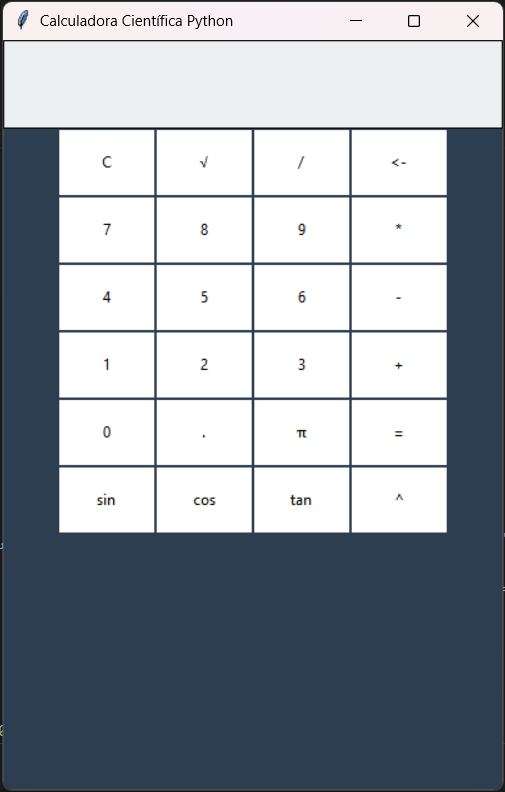

# 🧮 Calculadora Científica em Python
## 📸 Screenshot

Projeto desenvolvido para praticar lógica de programação com Python (Tkinter) e versionamento de código com Git/GitHub.

## 🚀 Funcionalidades
- Interface Gráfica limpa
- Operações matemáticas básicas
- Funções de Seno, Cosseno e Tangente
- Cálculo de Raiz Quadrada e Potência

## 🛠️ Tecnologias
- Python 3
- Biblioteca Tkinter